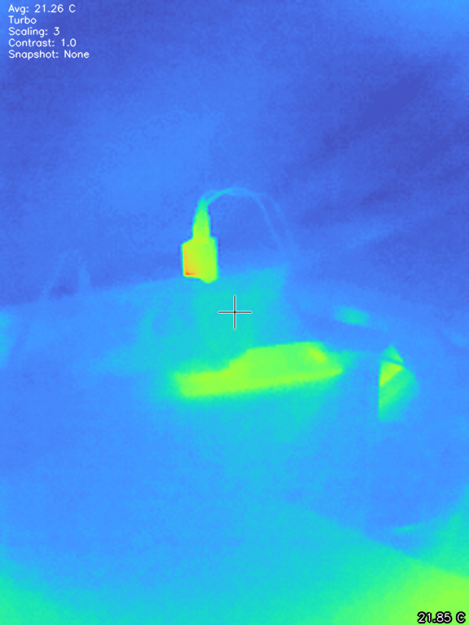

# PyThermalCamera

This is an edit of -> [github.com/leswright1977/PyThermalCamera](github.com/leswright1977/PyThermalCamera)

### changes

* added elements(text, crosshair) colors switching [white, green, red, blue]
* moved crosshair temp to bottom right
* moved record text to top right (only shows when recording)
* changed the colormaps
* added temperature conversion to F 
* switched from stacked 'if' statements to 'match/case'



# Colormaps

```shell
Bone
Turbo
RGB
Jet
Deep Green
Ocean
Hot
Inferno
Twilight Shifted
Viridis
Cividis
```

# Controls

```shell
C : Toggle Crosshair
M : Cycle through ColorMaps
N : Cycle element color
N : Toggle HUD
A Z: Change Interpolated scale
F V: Contrast
R T: Record and Stop
P : Take Image
W : Toggle Temperature Conversion
Q : quit
```

# TODO

* abandon this and rewrite in Go 🤣🤣🤣 
